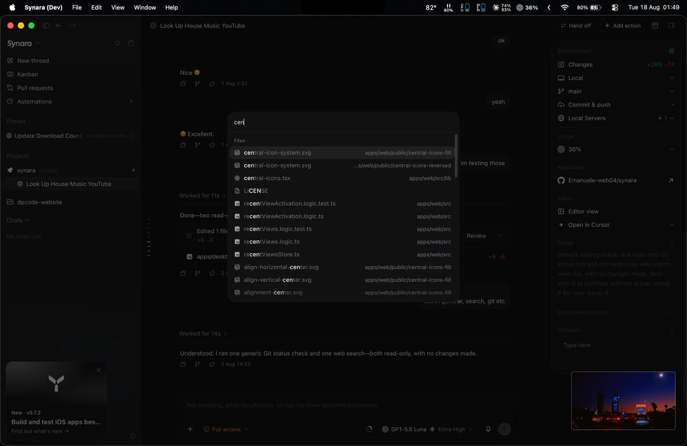
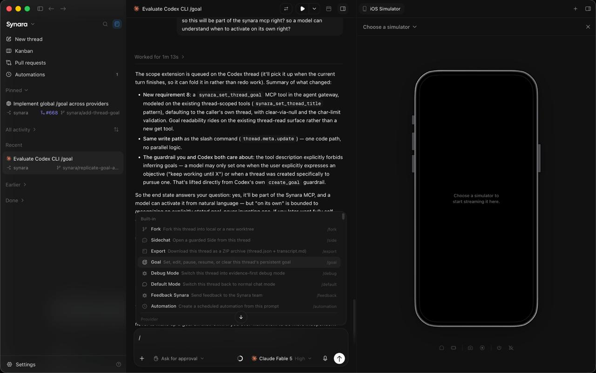
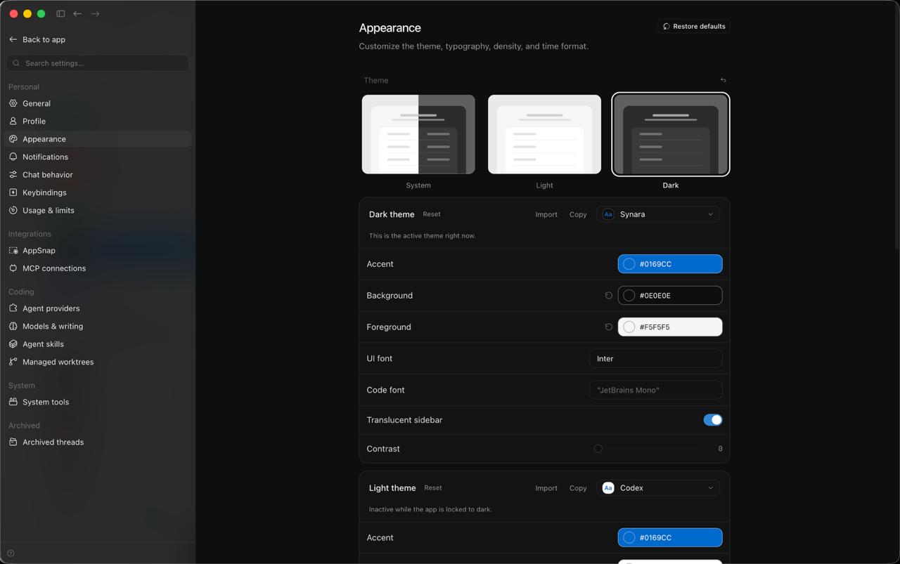

<div align="center">
  
  <h1>Synara</h1>
  <p><strong>A focused workspace for coding agents.</strong><br>
  Projects, provider sessions, execution surfaces, and review tools in one local-first desktop application.</p>
  <p>
    <a href="https://github.com/Emanuele-web04/synara/releases/latest">Download</a>
    &nbsp;·&nbsp;
    <a href="https://www.trysynara.com/">Website</a>
    &nbsp;·&nbsp;
    <a href="https://www.trysynara.com/docs">Documentation</a>
    &nbsp;·&nbsp;
    <a href="./docs/external-mcp.md">MCP integration</a>
    &nbsp;·&nbsp;
    <a href="https://github.com/Emanuele-web04/synara/issues/new/choose">Report an issue</a>
  </p>
</div>

<p align="center">
  <a href="https://github.com/Emanuele-web04/synara/releases/latest"></a>
  <a href="https://github.com/Emanuele-web04/synara/actions/workflows/ci.yml"></a>
  <a href="https://github.com/Emanuele-web04/synara/stargazers"></a>
  <a href="./LICENSE"></a>
</p>

<p align="center">
  
</p>

<p align="center"><em>The Synara workspace: conversation, project context, tools, and review in one surface.</em></p>

<p align="center"><sub>OPEN SOURCE&nbsp;&nbsp;·&nbsp;&nbsp;LOCAL-FIRST&nbsp;&nbsp;·&nbsp;&nbsp;PROVIDER-NATIVE</sub></p>

<table align="center">
  <tr>
    <td align="center" width="33%"><strong>Local-first</strong><br><sub>Projects, chats, and history remain on your machine.</sub></td>
    <td align="center" width="33%"><strong>Provider-native</strong><br><sub>Use the runtimes and accounts already configured locally.</sub></td>
    <td align="center" width="33%"><strong>Review-ready</strong><br><sub>Diffs, checks, Git, and delivery stay in context.</sub></td>
  </tr>
</table>

<details>
  <summary><strong>Table of contents</strong></summary>

  - [Overview](#overview)
  - [Capabilities](#capabilities)
    - [1. Projects, threads, and context](#1-projects-threads-and-context)
    - [2. Integrated workspace tools](#2-integrated-workspace-tools)
    - [3. Split views and previews](#3-split-views-and-previews)
    - [4. Provider-native integrations](#4-provider-native-integrations)
    - [5. Isolated parallel work](#5-isolated-parallel-work)
    - [6. Automations and external MCP](#6-automations-and-external-mcp)
    - [7. Appearance and workspace preferences](#7-appearance-and-workspace-preferences)
  - [Additional capabilities](#additional-capabilities)
  - [Installation](#installation)
    - [Desktop application](#desktop-application)
    - [Provider setup](#provider-setup)
    - [Run from source](#run-from-source)
  - [Local-first architecture](#local-first-architecture)
  - [FAQ](#faq)
  - [Documentation](#documentation)
  - [Development](#development)
  - [Contributing](#contributing)
  - [Project background](#project-background)
  - [License](#license)
</details>

## Overview

Synara is a desktop workspace for coding-agent sessions. It places the provider conversation alongside the project context, execution surfaces, previews, and review tools required to complete a change.

Synara does not replace the provider runtime. It coordinates the workspace around it, while the selected provider continues to manage its own account, model access, tools, permissions, and service connection.

<p align="center"><strong>Project</strong>&nbsp;&nbsp;→&nbsp;&nbsp;<strong>Thread</strong>&nbsp;&nbsp;→&nbsp;&nbsp;<strong>Provider session</strong>&nbsp;&nbsp;→&nbsp;&nbsp;<strong>Workspace tools</strong>&nbsp;&nbsp;→&nbsp;&nbsp;<strong>Review</strong></p>

| Workspace layer | Responsibility |
| --- | --- |
| **Project** | Repository context, settings, and related work. |
| **Thread** | Task-specific conversation, state, files, and history. |
| **Provider session** | The authenticated coding-agent runtime executing the task. |
| **Workspace tools** | Changes, terminal, browser, files, editor, previews, and Git. |

> [!NOTE]
> Synara is early-stage software. APIs and interface details remain under active development.

## Capabilities

### 1. Projects, threads, and context

Organize work around projects and threads. Projects define the workspace; threads preserve the task-specific conversation, state, files, and history.

- Project-aware navigation and conversations
- Provider and model selection per task
- Thread history, status, recaps, notes, and side chats
- Search and quick access across active work

### 2. Integrated workspace tools

The tools surrounding an agent session remain available from the same task surface, keeping execution and review connected.

| Surface | Purpose |
| --- | --- |
| **Changes** | Inspect diffs, changed files, and review state. |
| **Terminal** | Run commands in the project environment. |
| **Browser** | Keep local previews and browser work next to the thread. |
| **Files / Editor** | Browse, inspect, and edit project files in context. |
| **Git** | Work with branches, commits, pushes, and pull requests. |

### 3. Split views and previews

Keep an active conversation alongside the surface it is changing. Split views, browser previews, and device previews make the result part of the working context.

<p align="center">
  
</p>

### 4. Provider-native integrations

Synara connects to coding-agent runtimes that are installed and authenticated locally. The current development build includes the following integrations:

| Runtime | Local integration |
| --- | --- |
| **Codex** | Codex CLI / app-server |
| **Claude** | Claude Code |
| **Cursor** | Cursor agent runtime |
| **Antigravity** | Antigravity CLI |
| **Grok** | Grok Build |
| **Droid** | Factory Droid |
| **Kilo** | Kilo Code or a configured Kilo server |
| **OpenCode** | OpenCode and its configured model providers |
| **Pi** | Pi and its configured model providers |

### 5. Isolated parallel work

Managed worktrees provide a boundary for parallel changes. Handoffs preserve project context when a task needs to continue with another provider or toolchain.

- Run work in a local checkout or an isolated managed worktree
- Keep parallel threads from modifying the same checkout unintentionally
- Hand off a task without losing its project context
- Review the resulting diff before it leaves the workspace

### 6. Automations and external MCP

Automations support recurring agent runs and keep their outcomes attached to projects and threads. External MCP integrations provide scoped, user-approved access for other local clients.

See [External MCP integrations](./docs/external-mcp.md) for setup, pairing, project access, and permission boundaries.

### 7. Appearance and workspace preferences

Configure the shell to match the way you work with light and dark themes, typography controls, density preferences, and workspace settings.

<p align="center">
  
</p>

### Additional capabilities

| Workflow | Included surfaces |
| --- | --- |
| **Workspace** | Local projects, chats, history, and multiple provider runtimes. |
| **Execution** | Terminals, browser previews, files, and editor. |
| **Delivery** | Diffs, Git actions, managed worktrees, and pull requests. |
| **Orchestration** | Provider handoffs, automations, and scoped external MCP. |
| **Development** | Desktop shell plus focused server and web modes. |

## Installation

### Desktop application

Download the latest build from [GitHub Releases](https://github.com/Emanuele-web04/synara/releases) or visit [trysynara.com](https://www.trysynara.com/).

Current native release targets are Windows x64, macOS Intel, macOS Apple Silicon, and Linux x64.

### Provider setup

Synara uses the provider installations and subscriptions already configured on the local machine. Install and authenticate the runtime you intend to use before starting a session. For Codex sessions, follow the [Codex CLI setup](https://github.com/openai/codex).

### Run from source

The development checkout uses [Bun 1.3.12](https://bun.sh/) and [Node.js 24.13.1](https://nodejs.org/).

```console
git clone https://github.com/Emanuele-web04/synara.git
cd synara
bun install
bun run dev
```

Use `bun run dev:desktop` for the Electron shell. Focused modes are available through `bun run dev:server` and `bun run dev:web`.

## Local-first architecture

Synara stores projects, chats, and history on the local machine. It is not a hosted service for repositories or transcripts.

The selected provider still receives the prompts, file snippets, diffs, terminal output, or tool results required for a session. That traffic goes to the provider selected by the user, not through a separate Synara-hosted workspace.

## FAQ

### What is Synara?

Synara is the workspace around coding-agent runtimes. It manages projects, durable tasks, working environments, transcripts, review surfaces, and delivery workflows while the selected provider continues to own its models, tools, permissions, and service.

### Does Synara provide model access?

No. Synara uses the provider runtimes, accounts, subscriptions, and API credentials already configured on the local machine. Model availability and usage limits remain provider-owned.

### Does Synara upload code to its own cloud?

No. Synara stores workspace data locally and is not a proxy for normal provider traffic. The selected provider still receives the prompts, file snippets, diffs, terminal output, or tool results required for its session.

### Which providers can I use?

The current integrations include Codex, Claude Code, OpenCode, Cursor, Antigravity, Grok Build, Kilo Code, Pi, and Factory Droid. See the [provider documentation](https://www.trysynara.com/docs) for installation, authentication, and troubleshooting guides.

### How should I run multiple agents safely?

Give each body of work one owner and use separate Git worktrees for concurrent writers. Keep objectives independently reviewable and assign one integration owner before merging the results. The [official documentation](https://www.trysynara.com/docs) includes guides for parallel agents and worktrees.

### Where should I start?

Install Synara, authenticate one supported provider, open a clean Git repository, and begin with one bounded objective. Follow the [Quickstart and first-task guides](https://www.trysynara.com/docs) for the complete walkthrough.

## Documentation

- [Synara documentation](https://www.trysynara.com/docs)
- [External MCP integrations](./docs/external-mcp.md)
- [Canary and isolated development](./docs/canary.md)
- [Release and packaging](./docs/release.md)
- [Contributing guide](./CONTRIBUTING.md)

## Development

Run the focused checks from the repository root:

```console
bun run fmt:check
bun run lint
bun run typecheck
bun run test
```

For desktop packaging and release validation, see [docs/release.md](./docs/release.md). For isolated development, see [docs/canary.md](./docs/canary.md).

## Contributing

Bug fixes, reliability improvements, performance work, documentation, and maintenance changes are welcome.

Read [CONTRIBUTING.md](./CONTRIBUTING.md) before opening a pull request. For a reproducible problem, [open an issue](https://github.com/Emanuele-web04/synara/issues/new/choose) with the Synara version, operating system, runtime, and relevant logs.

## Project background

Synara began as a clone of [T3Code](https://github.com/pingdotgg/t3code), but it has since become a substantially different product with its own branding, packaging, release system, provider orchestration, desktop behavior, and product direction.

## License

Synara is licensed under the [MIT License](./LICENSE).
