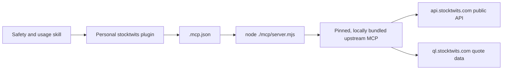

# Plan 015 - StockTwits MCP Plugin

Status: BLOCKED - package installed; reviewed live endpoints return HTTP 403
Priority: P2
Effort: M
Target: Personal Codex plugin on Windows
Verified against upstream: 2026-08-10 at commit `3c3f6de9192eb910612f5e3d701872adc8ee524b`

## Goal

Create an installable personal plugin named `stocktwits` that exposes the
official StockTwits MCP server's public market-data and social-sentiment tools
to Codex. The integration must start reliably on Windows, use no StockTwits
credentials, make its upstream provenance clear, and treat social posts as
untrusted data rather than agent instructions.

This is a plugin-packaging and hardening plan. It does not add a StockTwits
provider to Synara or modify Synara's server, web app, contracts, or provider
protocol.

References:

- [StockTwits MCP repository](https://github.com/stocktwits/stocktwits-mcp)
- [Upstream source at the reviewed commit](https://github.com/stocktwits/stocktwits-mcp/blob/3c3f6de9192eb910612f5e3d701872adc8ee524b/src/index.ts)
- [Upstream package manifest](https://github.com/stocktwits/stocktwits-mcp/blob/3c3f6de9192eb910612f5e3d701872adc8ee524b/package.json)
- [Upstream MIT license](https://github.com/stocktwits/stocktwits-mcp/blob/3c3f6de9192eb910612f5e3d701872adc8ee524b/LICENSE)

## Verified upstream findings

The reviewed repository is a small Node/TypeScript stdio MCP server:

- Server identity: `stocktwits-mcp`, version `1.0.0`.
- Runtime: Node.js 18 or newer.
- Transport: stdio only; it exposes no hosted HTTP MCP endpoint or MCP App UI.
- Authentication: none. It calls public StockTwits endpoints.
- Tool surface: nine read-only tools covering prices, symbol metadata,
  messages, computed sentiment, trending symbols, symbol search, and public
  user data.
- External origins: `https://api.stocktwits.com/api/2` and
  `https://ql.stocktwits.com`.
- Upstream documents a limit of 200 public API requests per hour per IP.
- License: MIT, Copyright 2026 StockTwits.
- Repository maturity: four commits, no release artifact, and no published
  version pin in the documented setup command at review time.

Source review also found constraints that the plugin must not hide:

1. The documented command, `npx -y github:stocktwits/stocktwits-mcp`, follows a
   moving Git branch and executes package lifecycle scripts.
2. The upstream build script is `tsc && chmod +x dist/index.js`. With the
   default Windows npm script shell, the reviewed commit exited during the
   `npx` install because `chmod` is unavailable.
3. A commit-pinned `bunx` attempt also failed because it could not determine
   the executable for the Git dependency.
4. The fetch helper has no explicit request timeout, retry/backoff, or cache.
5. Tool inputs do not enforce minimum/maximum integers, and symbol path values
   are not URL-encoded. The bundled build should add narrow input hardening.
6. Tool results are JSON serialized into MCP text content rather than declared
   structured output.
7. Sentiment summaries are simple counts over up to 30 recent messages. The
   bullish percentage excludes neutral posts, so it is a small-sample platform
   signal, not a statistically representative market indicator.
8. Message bodies and profiles are user-generated content and may contain
   misleading claims or prompt-injection text.

## Architecture



Preferred package layout:

```text
C:\Users\roube\plugins\stocktwits\
|-- .codex-plugin\
|   `-- plugin.json
|-- .mcp.json
|-- UPSTREAM.md
|-- THIRD_PARTY_NOTICES.md
|-- mcp\
|   `-- server.mjs
|-- scripts\
|   |-- build-stocktwits-mcp.ps1
|   `-- upstream-lock.json
|-- skills\
|   `-- stocktwits\
|       `-- SKILL.md
`-- assets\
    |-- icon.png
    `-- logo.png
```

The default personal marketplace remains:

```text
C:\Users\roube\.agents\plugins\marketplace.json
```

## Key decisions

1. Use the official upstream implementation, but do not launch a floating Git
   dependency with `npx` on every MCP startup.
2. Ship a reviewed, commit-pinned, standalone `mcp/server.mjs` bundle so runtime
   startup needs only Node and does not install packages or run lifecycle
   scripts.
3. Keep a reproducible build recipe and lock metadata beside the bundle. Every
   upstream update is an explicit review and plugin release, never automatic
   tracking of `main`.
4. Carry only a minimal, documented hardening patch: fixed official origins,
   bounded fetch time, normalized symbol/username inputs, `1..30` integer
   limits, and read-only MCP annotations where the SDK supports them.
5. Use a host tool timeout as a second boundary; do not rely on it as a
   substitute for aborting network requests inside the server.
6. Include a focused skill for tool selection, rate-budget discipline,
   financial-data caveats, and prompt-injection resistance.
7. Brand the package as a local integration based on StockTwits' MIT-licensed
   server. Do not imply that the local plugin is published or supported by
   StockTwits.
8. Keep the plugin read-only. Do not add posting, liking, following, trading,
   brokerage, or credentialed account actions.

## Workstreams

Execute these in order:

1. [Audit the pinned upstream and prove the runtime contract](./01-upstream-and-runtime-compatibility.md)
2. [Build and package the pinned MCP server](./02-plugin-package-and-bundled-server.md)
3. [Add safety guidance, validate, and install](./03-skill-security-and-installation.md)
4. [Run end-to-end, failure-path, and update verification](./04-end-to-end-verification-and-updates.md)

## Definition of done

- `stocktwits` appears in the personal Plugins Directory and can be enabled.
- A new Codex task discovers exactly the nine reviewed read-only tools.
- The installed plugin starts without `npx`, `bunx`, Git, npm installation, or
  a shell-specific `chmod` command.
- The bundle is traceable to a full upstream commit SHA and archive hash, and
  its notices preserve required license text.
- Price, symbol, trending, message, sentiment, search, and public-user scenarios
  return intelligible results against the live service.
- Invalid inputs, upstream errors, timeouts, rate limits, and offline startup
  fail clearly and remain bounded.
- Social message content is quoted or summarized as untrusted user content and
  never treated as instructions.
- Responses identify the source and sampling limitations and do not frame
  StockTwits sentiment as investment advice or verified fact.
- The plugin and bundled skill validators pass with no placeholders or broken
  asset paths.
- A repeatable update procedure proves that upgrading requires a reviewed
  commit/hash/version change and a new task after reinstall.

## Non-goals

- Modifying the upstream StockTwits repository.
- Publishing this integration to a public plugin marketplace.
- Adding authenticated StockTwits account features.
- Executing trades or connecting a brokerage account.
- Treating StockTwits price data as an exchange-grade real-time market feed.
- Building dashboards, charts, or an MCP App UI.
- Changing Synara source code or the dirty root `plans/README.md`.

## STOP conditions

- Stop if the reviewed source begins requiring StockTwits credentials or adds
  write-capable/account tools.
- Stop if a reproducible pinned bundle cannot be produced without executing
  unreviewed lifecycle code.
- Stop if implementation cannot preserve upstream license notices and source
  provenance.
- Stop if the installed host cannot resolve plugin-relative `cwd` and
  `./mcp/server.mjs` paths.
- Stop if live discovery materially differs from the nine-tool contract; audit
  the new upstream revision before changing this plan.
- Stop if the plugin needs edits to Synara code, unrelated personal plugins, or
  existing user-owned marketplace entries beyond appending `stocktwits`.

## Verification policy

This plan creates a personal plugin outside the Synara source tree. Repository
`bun fmt`, `bun lint`, and `bun typecheck` are not relevant unless an executor
expands scope into Synara code. Plugin validation, skill validation, bundle
provenance checks, dependency audit, MCP protocol smoke tests, and live
failure-path tests are required.

## Implementation status (2026-08-10)

The personal plugin is implemented, hardened, installed, and discoverable by a
fresh Codex task. The package and MCP protocol acceptance criteria pass, but
live data acceptance is blocked by StockTwits: both public origins used by the
reviewed upstream server return HTTP 403 for their documented unauthenticated
requests.

Completed evidence:

- Installed and enabled `stocktwits@personal` version `0.1.0` with desktop
  `codex-cli 0.147.0-alpha.6.5`.
- Produced a reproducible Node 18-compatible standalone bundle from upstream
  commit `3c3f6de9192eb910612f5e3d701872adc8ee524b`.
- Preserved the nine-tool read-only contract and added bounded inputs, path
  normalization, HTTPS-origin allowlisting, redirect rejection, a 15-second
  fetch timeout, and a 5 MB response limit.
- Repaired the pinned runtime dependency graph from eight reported
  vulnerabilities to zero `npm audit --omit=dev` findings before bundling.
- Passed plugin validation, skill validation, reproducible-build verification,
  offline protocol smoke tests, installed-cache verification, and fresh-task
  tool discovery.
- Verified that a traversal-style symbol is rejected locally before any
  upstream request.

Blocked evidence:

- `get_trending` receives `403 Forbidden: /api/2/trending/symbols.json` from
  `api.stocktwits.com`.
- `get_stock_price` receives `403 Forbidden: /pricedata` from
  `ql.stocktwits.com`.
- StockTwits' official developer page says its API, documentation, and terms
  are under review and that new application registrations are unavailable.
  The implementation does not scrape pages, impersonate a browser, or bypass
  access controls.

See [IMPLEMENTATION-REPORT.md](./IMPLEMENTATION-REPORT.md) for the provenance,
validation matrix, install evidence, live-service findings, and remaining
acceptance work.
